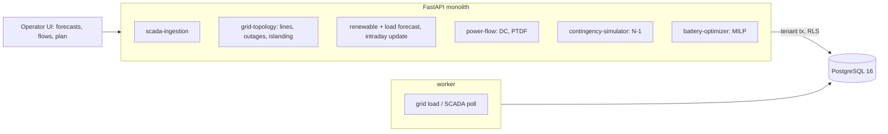

# Digital Twin for Large-Scale Renewable Energy

For a transmission operator with a lot of wind and solar: it forecasts renewables and load from weather with a band, updates the
forecast from telemetry as the day goes wrong, runs DC power flow on the network as it actually stands, scans every further single-line
outage, and plans battery charging, curtailment and thermal output to midnight with the line limits enforced, scoring every way of
running the day against what the weather really did.

Built from blueprint 15 of "Advanced Engineering Build Book, Volume III" as a **vertical slice**: the demo scenario end to end,
with the platform parts real and the rest listed under [Not built](#not-built-and-why).

**The network, its assets, weather, telemetry and prices are generated by a simulator in this repository: a synthetic 118-bus network,
not the IEEE case and not a real grid. The twin that scores the plans is the generator itself, with DC power flow as the physics, which
makes its numbers the best a real twin could reach.**

## Run it

```bash
docker compose up --build        # migrates, seeds, serves http://localhost:8225/ui/ with one worker
docker compose run --rm test     # 11 tests against a throwaway database (about 5 s)
```

Open http://localhost:8225/ui/ and press **Run all steps** (about 4 seconds), or `make bootstrap demo`.
Demo tokens (local only): `grid-control_manager-demo`, `grid-operator-demo`, `grid-viewer-demo`. Run `make reset` before a second demo run.

## The demo, step by step

1. 10:00 on an invented 118-bus network: 180 lines (14 radial), 3.5 GW of thermal in the metro and east, 1.3 GW of solar in the west, 0.9 GW of wind in the north, six four-hour batteries (0.5 GW). Forecast models trained on sixty days and scored on the last ten: solar 21.5 MW off against 72.8 for persistence; wind 46.9 against 49.5 for the power curve, which is how the generator makes wind; load 25.7 against 40.1 for last week. The DC power flow on the latest telemetry has every line within its limit.
2. Two hours of SCADA arrive. From 11:00 a cloud bank sits over the solar region that no forecast saw. At 12:00 line 115 on the wind export corridor trips. An attempt to open a radial line is refused (it would cut off 72 buses), and three bad SCADA readings are refused one by one.
3. Over the last hour solar ran at 38% of the day-ahead forecast, 668 MW short. The intraday update cuts the afternoon's solar from 5,582 to 3,898 MWh; the truth is 2,893, because the cloud stays until 16:00. With line 115 out, line 153 carries 241% of its limit. The N-1 scan from this topology finds two lines already over, 39 further outages that would add an overload and 14 that would island buses.
4. The dispatch MILP to midnight on the intraday forecast and the post-outage network: 1,106 MWh of planned curtailment, 1,285 MWh through the batteries, 59 line limits added in two rounds, never charging and discharging at once. Then every way of running the afternoon on the true weather: network-blind with no battery ($382,370, 100% of renewables used, 480 overload minutes at up to 285%); the 12:00 plan ($428,892, 84%, 30 minutes at up to 102%); re-planned hourly with batteries ($428,031, 85%); without them (84%); perfect knowledge ($406,458, 91%, no overloads).
5. The audit log, in a hash chain.

## Architecture



| Piece | How it works |
|---|---|
| Simulator (`rg/world.py`) | 118 buses in four regions on a 100 km square; each bus joined to its two nearest neighbours, components joined, then meshed to 180 lines with reactance by length; line limits 15–45% above the most each line carried in sixty days of network-blind operation, so the intact grid is secure; weather per region as autocorrelated cloud and wind with autocorrelated forecast error; solar from clear-sky output times cloud, wind from a power curve; load from a daily profile, weekday and temperature; prices from net load. The demo outage is the line whose loss most overloads the wind export corridor. |
| Power flow | DC: the reduced susceptance matrix inverted once per topology into a PTDF (slack at bus 1); every flow is PTDF times injections. Connectivity is checked before every solve; an outage that islands buses is refused with the count. |
| Forecasts | Gradient-boosted trees from forecast weather to per-unit solar and wind, spread over sites by capacity; quantile trees for load. Baselines: persistence, the physical formula, last week. The intraday update scales the rest of the day by the last hour's actual over forecast, decaying back with a two-hour half-life. |
| Dispatch | `scipy.optimize.milp` (HiGHS) at 15-minute steps to midnight: thermal by cost, renewables up to availability, one binary per battery per step so it never charges and discharges at once, state of charge with 92% efficiency ending no emptier than the day began, $8/MWh battery wear, shed and overload as costly slack; line limits through the PTDF of the current topology, added in rounds wherever the solution breaks one. |
| N-1 | Every further single outage: islanding, or the lines it newly pushes over their limit; lines already over are reported once. |
| Scoring | Every strategy on the true weather: renewables at their true availability (capped by a plan's curtailment), batteries as scheduled, thermal rebalancing the forecast error cheapest first, true DC flows; cost, renewables used over available, curtailment, overload minutes, worst loading. |
| Platform | Row-level security per operator, Postgres job queue, Idempotency-Key replay, hash-chained audit log, `/metrics`. |

## Data model

`migrations/002_grid.sql` follows the blueprint (grid_nodes, lines, assets, telemetry, forecasts, batteries, dispatch_plans,
dispatch_steps); additions are marked `(+)`: grids (seed and clock), region and bus on nodes, line numbers and status times, forecast
kind (day-ahead or intraday), the batteries' current charge, plan summaries.

## API

| Method | Endpoint | Purpose |
|---|---|---|
| POST | `/v1/telemetry` | SCADA readings, each checked |
| GET | `/v1/grid/state` | The grid now: generation, batteries, the most loaded lines |
| POST | `/v1/forecast/renewables` | Day-ahead, actual so far, the error, the intraday update |
| POST | `/v1/forecast/load` | Load with an 80% band |
| POST | `/v1/powerflow` | DC flow at a step, optionally with more lines out; islanding refused |
| POST | `/v1/dispatch/optimize` | The MILP to midnight, stored, scored with the alternatives |
| POST | `/v1/contingencies` | N-1 from the current topology |
| GET | `/v1/plans/{id}` | A stored plan |
| POST | `/v1/grid/lines/{n}/status` | (+) A line trips or returns; islanding refused |
| POST | `/v1/grid:load` · `/v1/telemetry:poll` | (+) 202 + job: load the network; SCADA delivers the next readings |

Contract: [`docs/openapi.json`](docs/openapi.json).

## Measured

[`docs/evaluation.md`](docs/evaluation.md) (`python -m rg.evaluate`, three networks the demo never uses) and
[`docs/performance.md`](docs/performance.md).

| Component | Result | Baseline |
|---|---|---|
| Solar forecast, MW | 15–20 | persistence 60–74; clear sky 123–135 |
| Wind forecast, MW | 58–78 | power curve 76–95; persistence 319–374 |
| Load forecast, MW | 24–27 | last week 38–41 |
| Intraday update, afternoon solar | closes about two thirds of the gap | day-ahead 1.9× the truth |
| Network-blind operation | 480–645 overload minutes at 274–449% | |
| Plans respecting the limits | 15–165 minutes, all within 110% | 14–39% dearer, 14–29% curtailed |
| Batteries | 0–2 points of utilisation | |
| Perfect knowledge of the weather | 3–6 points more utilisation, no overloads | |

Three things these numbers say plainly. The cheapest way to run the afternoon is to ignore the broken corridor, and the page says that
the extra cost is what staying inside the limits costs, not a loss. Re-planning every hour from fresh telemetry did not beat the single
noon plan on the unseen networks, because every re-plan carries the same assumption that the cloud is about to clear. And the batteries
are worth little here: only the ones behind the constraint help, and the optimiser sometimes leaves them idle.

## The hardest tradeoff

What to compare against. A dispatch that respects line limits will always lose on cost and renewable use to one that ignores them, and a
page that leads with "the optimiser saved X" against a network-blind baseline would be claiming a saving that is really an overload. So
the comparison is run on the true weather with the true flows, the network-blind strategies are shown with their overload minutes and
worst loading, and the honest gains are the ones between strategies that all respect the network: batteries (small), re-planning
(none), and knowing the weather (the largest, and the one no optimiser provides).

## Threat model (summary)

| Threat | Mitigation here | Gap |
|---|---|---|
| A bad SCADA reading steering the plan | Unknown assets, no timezone, future times and out-of-range values refused one by one; the batch audited | No cross-checking of readings against neighbours |
| Opening a line that islands load | Connectivity checked before any line goes out; refused with the number of buses cut off | Switching orders are records, not commands |
| A plan acted on that breaks a limit | Line limits enforced through the PTDF of the current topology; the plan's own maximum loading reported; every plan stored with its objective | No N-1 security inside the dispatch |
| One operator seeing another's grid | Row-level security on every table; tested through the API and directly in the database | |

## Not built, and why

- **AC power flow, voltages, reactive power, stability**: DC flow is the blueprint's baseline; an AC adapter is the next piece.
- **Security-constrained dispatch**: the N-1 scan ranks outages; enforcing every case inside the MILP multiplies it by 179.
- **NREL, NOAA and IEEE data**: generated instead, so every plan can be scored against the truth.
- **Market interface, unit commitment, ramp limits**: thermal units dispatch freely between zero and capacity.
- **A temporal transformer for forecasts**: gradient-boosted trees already match the physical formulas the generator uses.
- **Kafka, Redis, OpenTelemetry, Grafana, MLflow, Terraform, CI, SSO, a Next.js front end**: not needed to prove the slice; no cloud account used.

## Commercial sketch

Buyer: utilities, independent power producers, microgrid operators, renewable developers. Pricing shape from the blueprint: per MW
managed or per site, an enterprise grid-planning licence, scenario compute credits, private deployment.

## Layout

```
core/        platform kit: db + RLS, jobs, audit chain, HTTP, scenario runner, load test
rg/          world (network, weather, output, DC physics), engine (forecasts, nowcast, MILP dispatch, scoring, N-1), api, seed, evaluate
migrations/  forward-only SQL          web/   UI, scenario.json, demo.json (recorded run)
tests/       11 tests                  docs/  evaluation.md, performance.md, openapi.json
```
